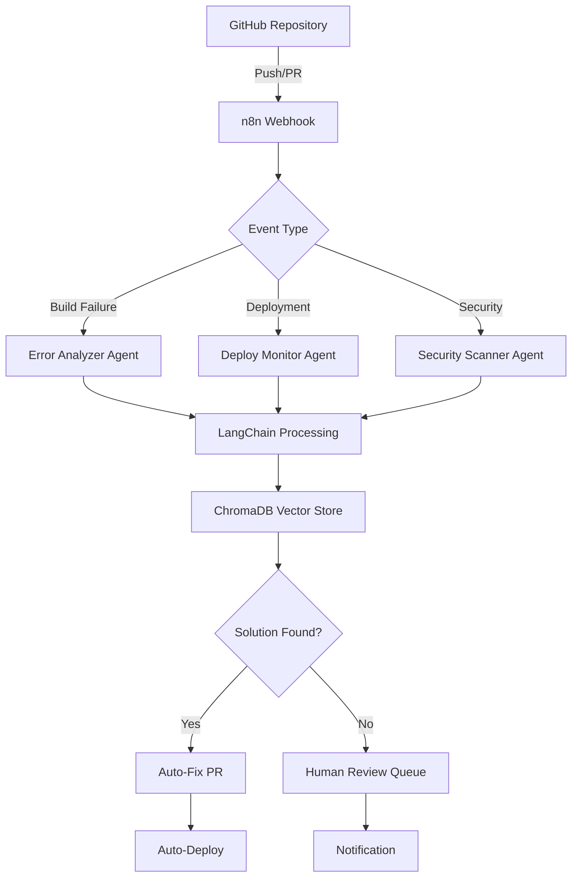

# 🤖 AI DevOps Orchestrator

**LangChain + n8n 기반 자동 트러블슈팅 및 배포 파이프라인 (concept / early prototype)**

[](#-current-status)
[](https://opensource.org/licenses/MIT)
[](https://hub.docker.com)

> ⚠️ **Status: Early Prototype.** 본 저장소는 LangChain + n8n 기반 DevOps 오케스트레이션의
> **컨셉 데모**입니다. 현재 구현은 FastAPI 엔드포인트 1개와 키워드 매칭 기반 응답이며,
> ChromaDB 벡터 학습·멀티 에이전트·자동 PR 생성 등은 **모두 로드맵**입니다.
> 아래 "📊 Current Status" 섹션을 먼저 참고하세요.

## 📊 Current Status

| 영역 | 상태 |
|------|------|
| FastAPI 헬스체크 + `/analyze` 엔드포인트 | ✅ 동작 (키워드 매칭 기반) |
| docker-compose 정의 (langchain-api, n8n, ChromaDB, Redis) | ✅ 작성됨 |
| n8n 워크플로우 JSON 1개 | ✅ 작성됨 |
| LangChain 통합 (LLM 추론, 프롬프트 체인) | 📋 미구현 (의존성만 선언) |
| ChromaDB 벡터 학습·검색 | 📋 미구현 (의존성만 선언) |
| 멀티 에이전트 (Error/Security/Performance/...) | 📋 로드맵 |
| GitHub Auto-Fix PR 생성 | 📋 로드맵 |
| 자체 CI/CD (lint, type, test) | 📋 미구성 |
| 테스트 (`tests/`) | 📋 비어있음 |

> 현 구현의 `/analyze`는 에러 로그에 특정 키워드(`pure-rand` 등)가 포함되면
> 미리 정의된 fix 제안을 반환합니다. LLM/벡터 검색은 아직 호출하지 않습니다.

## 🎯 Planned Features (Roadmap)

아래는 **목표 기능**이며 현재 구현되지 않았습니다.

### 🔄 자동화 파이프라인 (목표)
```
GitHub Push → n8n Trigger → LangChain Analysis → ChromaDB Learning → Auto-Fix
     ↓             ↓              ↓                ↓               ↓
  실시간 감지   워크플로우 실행   AI 에이전트       벡터 저장      Fix 제안
```

### 🎯 차별화 포인트 (목표)
- **🧠 실시간 학습**: 매 배포마다 에러 패턴 축적 및 예측적 해결
- **🌐 멀티 프레임워크**: Next.js, Django, React, Vue, Spring Boot
- **⚡ 자동 롤백**: 헬스체크 실패 시 직전 SHA로 복원
- **📊 벡터 기반 학습**: ChromaDB로 cross-project 패턴 공유

### 📚 Reference Patterns (Hardcoded Examples)

`/analyze` 엔드포인트가 인식하는 키워드와 응답으로 미리 정의된 패턴들입니다.
실제 fix는 별도 사람·도구가 수동으로 적용한 사례에서 추출했으며, 이 저장소가
직접 자동 적용한 결과는 아닙니다.

- **Prisma v7 의존성 체인**: `pure-rand` → `pathe` → `proper-lockfile`
- **Docker Alpine 호환성**: `npx` → `node node_modules/prisma/build/index.js` 직접 경로
- **GitHub Actions 러너**: hosted → self-hosted 전환 가이드

## 🚀 빠른 시작 (로컬 실행)

> 현재 시작하면 docker-compose 스택은 기동되지만, `/analyze`는 키워드 매칭만 수행합니다.

### 1. 저장소 클론
```bash
git clone https://github.com/rladmsgh34/ai-devops-orchestrator.git
cd ai-devops-orchestrator
```

### 2. 환경 설정
```bash
cp .env.example .env
# .env 파일에서 키 설정:
# - OPENAI_API_KEY / ANTHROPIC_API_KEY (현 시점에는 사용되지 않음 — 통합 예정)
# - GITHUB_TOKEN
# - N8N_BASIC_AUTH_PASSWORD (반드시 기본값 'changeme'에서 변경)
```

### 3. 실행
```bash
docker-compose up -d
```

### 4. 대시보드 접속
- **n8n**: http://localhost:5678
- **API 헬스체크**: http://localhost:8000/health
- **ChromaDB**: http://localhost:8001 (서비스만 기동, 학습 코드는 미구현)

## 🏗️ 아키텍처



## 🤖 AI 에이전트 로드맵 (모두 미구현)

> 현재 구현된 에이전트는 없습니다. 아래는 설계 단계의 목표 구성입니다.

### 1. Error Pattern Analyzer (📋 Planned)
- **역할**: 빌드/배포 에러 실시간 분석
- **기술 후보**: LangChain + GPT-4 / Claude
- **목표**: 의존성 체인, 환경 차이, 설정 오류 패턴 학습

### 2. Security Vulnerability Scanner (📋 Planned)
- **역할**: 보안 취약점 자동 탐지
- **기술 후보**: OWASP Top 10 + 커스텀 룰셋

### 3. Performance Regression Detector (📋 Planned)
- **역할**: 성능 저하 사전 감지
- **기술 후보**: 메트릭 트렌드 분석

### 4. Infrastructure Monitor (📋 Planned)
- **역할**: 인프라 상태 모니터링
- **기술 후보**: Docker, Kubernetes, GCP/AWS

### 5. Code Quality Enforcer (📋 Planned)
- **역할**: 코드 품질 표준 유지
- **기술 후보**: ESLint, SonarQube

### 6. Deployment Orchestrator (📋 Planned)
- **역할**: 배포 파이프라인 자동 관리
- **기술 후보**: GitOps + Canary

## 🌟 지원 프레임워크 (목표)

> 현재 어느 프레임워크도 자동 fix를 적용하지 않습니다. 아래는 목표 범위입니다.

| 프레임워크 | 언어 | 상태 |
|-----------|------|------|
| Next.js | TypeScript/JavaScript | 📋 Planned (참고 패턴 일부 하드코딩) |
| Django | Python | 📋 Planned |
| React | TypeScript/JavaScript | 📋 Planned |
| Vue.js | TypeScript/JavaScript | 📋 Planned |
| Spring Boot | Java/Kotlin | 📋 Planned |
| FastAPI | Python | 📋 Planned |
| Ruby on Rails | Ruby | 📋 Planned |

## 📈 목표 지표 (Aspirational, 측정 전)

> 아래 수치는 **벤치마크가 아닌 목표값**입니다. 실제 성과 측정은 통합 후 별도 보고합니다.

- 디버깅 시간 단축
- 배포 실패율 감소
- MTTR 단축
- CI/CD 비용 절감

(상세 수치는 실제 통합·측정 이후 본 README에 추가합니다.)

## 🔧 커스터마이징

### 새로운 프레임워크 추가
```python
# analyzers/custom_framework_analyzer.py
class CustomFrameworkAnalyzer(BaseAnalyzer):
    framework = "custom-framework"
    
    def analyze_error(self, error_log: str, project_config: dict):
        # 커스텀 에러 패턴 분석 로직
        return self.generate_solution(error_log)
        
    def get_fix_suggestions(self, analysis_result: dict):
        # 자동 수정 제안 로직
        return suggestions
```

### 커스텀 워크플로우 추가
```javascript
// n8n-workflows/custom-trigger.json
{
  "name": "Custom Project Monitor",
  "nodes": [
    {
      "name": "Webhook Trigger",
      "type": "n8n-nodes-base.webhook"
    },
    {
      "name": "AI Analysis",
      "type": "n8n-nodes-base.httpRequest",
      "parameters": {
        "url": "http://langchain-api:8000/analyze"
      }
    }
  ]
}
```

## 🤝 기여하기

우리는 오픈소스 커뮤니티의 기여를 환영합니다!

### 🚀 기여 방법
1. **Fork** 이 저장소
2. **Feature 브랜치 생성**: `git checkout -b feature/amazing-feature`
3. **변경사항 커밋**: `git commit -m 'feat: add amazing feature'`
4. **브랜치에 Push**: `git push origin feature/amazing-feature`
5. **Pull Request 생성**

### 📋 기여 아이디어
- [ ] **새로운 프레임워크 지원** (Laravel, Angular, etc.)
- [ ] **클라우드 플랫폼 확장** (AWS, Azure, Vercel)
- [ ] **알림 채널 추가** (Slack, Discord, Teams)
- [ ] **메트릭 대시보드** (Grafana, Prometheus 연동)
- [ ] **다국어 지원** (중국어, 일본어, 스페인어)

## 📄 라이선스

이 프로젝트는 [MIT License](LICENSE)하에 배포됩니다.

## 🌟 Star History

[](https://star-history.com/#rladmsgh34/ai-devops-orchestrator&Date)

## 💬 커뮤니티

- **GitHub Discussions**: [토론 참여](https://github.com/rladmsgh34/ai-devops-orchestrator/discussions)
- Discord / Twitter: 운영 전 (커뮤니티 채널은 향후 개설 예정)

## 🙏 감사 인사

- **LangChain** - AI 에이전트 프레임워크
- **n8n** - 워크플로우 자동화 플랫폼  
- **ChromaDB** - 벡터 데이터베이스
- **Docker** - 컨테이너화 플랫폼
- **모든 기여자들** - 오픈소스 커뮤니티

---

**"Automate the boring stuff, focus on what matters."** 🚀