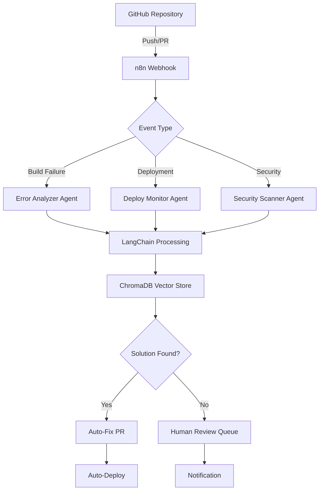

# 🤖 AI DevOps Orchestrator

**LangChain + n8n 기반 자동 트러블슈팅 및 배포 파이프라인**

[](https://opensource.org/licenses/MIT)
[](https://hub.docker.com)
[](https://github.com/langchain-ai/langchain)

> ⚠️ **재정의 중 (2026-05 ~)**: 본 저장소는 "Claude Code(생성) → Antigravity(검증) → 사용자(승인)" 워크플로우의 **지휘자(conductor)** 모델로 재정의되었습니다. 아래 README의 "AI 6개 에이전트가 자동으로 수정 PR을 만든다"는 기존 모델은 폐기되었으며, 일부 컴포넌트(보안 스캐너, 코드 품질 룰 엔진, Auto-Fix PR)는 검증자(Antigravity) 역할과 충돌하여 제거되었습니다.
>
> 새 설계는 다음을 참조하세요:
> - [`CLAUDE.md`](./CLAUDE.md) — 프로젝트 운영 규칙
> - [`docs/ARCHITECTURE.md`](./docs/ARCHITECTURE.md) — 지휘자 모델, 컴포넌트 매트릭스
> - [`docs/PIPELINE_STATES.md`](./docs/PIPELINE_STATES.md) — 승인 상태머신
> - [`cases/`](./cases) — 실제 케이스 로그 (개선의 유일한 근거)

## ✨ 핵심 기능

### 🔄 완전 자동화 파이프라인
```
GitHub Push → n8n Trigger → LangChain Analysis → ChromaDB Learning → Auto-Fix
     ↓             ↓              ↓                ↓               ↓
  실시간 감지   워크플로우 실행   AI 6개 에이전트    벡터 저장    즉시 해결
```

### 🎯 차별화 포인트
- **🧠 실시간 학습**: 매 배포마다 에러 패턴 축적 및 예측적 해결
- **🌐 멀티 프레임워크**: Next.js, Django, React, Vue, Spring Boot 지원
- **⚡ 제로 다운타임**: 자동 롤백 + 헬스체크 연동
- **📊 벡터 기반 학습**: ChromaDB로 cross-project 패턴 공유

### 🔥 실제 검증된 사례
- **Prisma v7 의존성 체인 문제**: `pure-rand` → `pathe` → `proper-lockfile` 연쇄 해결
- **Docker Alpine 호환성**: `npx` → 직접 경로 자동 전환
- **GitHub Actions 비용**: hosted → self-hosted 자동 감지 및 전환

## 🚀 빠른 시작 (3분 설치)

### 1. 저장소 클론
```bash
git clone https://github.com/rladmsgh34/ai-devops-orchestrator.git
cd ai-devops-orchestrator
```

### 2. 환경 설정
```bash
cp .env.example .env
# .env 파일에서 필요한 API 키 설정:
# - OPENAI_API_KEY (또는 ANTHROPIC_API_KEY)
# - GITHUB_TOKEN
# - PROJECT_WEBHOOK_URL
```

### 3. 원클릭 실행
```bash
docker-compose up -d
```

### 4. 대시보드 접속
- **n8n 워크플로우**: http://localhost:5678
- **LangChain API**: http://localhost:8000
- **ChromaDB**: http://localhost:8001

## 🏗️ 아키텍처



## 🤖 AI 에이전트 구성

### 1. Error Pattern Analyzer
- **역할**: 빌드/배포 에러 실시간 분석
- **기술**: LangChain + GPT-4/Claude
- **특징**: 의존성 체인, 환경 차이, 설정 오류 패턴 학습

### 2. Security Vulnerability Scanner  
- **역할**: 보안 취약점 자동 탐지
- **기술**: OWASP Top 10 + 커스텀 룰셋
- **특징**: XSS, SQL Injection, 의존성 취약점 스캔

### 3. Performance Regression Detector
- **역할**: 성능 저하 사전 감지
- **기술**: 메트릭 트렌드 분석
- **특징**: 응답 시간, 메모리 사용량, DB 쿼리 최적화

### 4. Infrastructure Monitor
- **역할**: 인프라 상태 24/7 모니터링  
- **기술**: Docker, Kubernetes, GCP/AWS 연동
- **특징**: 리소스 사용량, 헬스체크, 자동 스케일링

### 5. Code Quality Enforcer
- **역할**: 코드 품질 표준 유지
- **기술**: ESLint, SonarQube, 커스텀 룰
- **특징**: 복잡도 분석, 테스트 커버리지, 문서화 검증

### 6. Deployment Orchestrator
- **역할**: 배포 파이프라인 자동 관리
- **기술**: GitOps + Canary 배포
- **특징**: 단계별 배포, 자동 롤백, 헬스체크 연동

## 🌟 지원 프레임워크

| 프레임워크 | 언어 | 지원 상태 | 특수 기능 |
|-----------|------|-----------|----------|
| **Next.js** | TypeScript/JavaScript | ✅ 완전 지원 | App Router, Prisma 호환 |
| **Django** | Python | ✅ 완전 지원 | ORM 최적화, Celery 연동 |
| **React** | TypeScript/JavaScript | ✅ 완전 지원 | Vite, Webpack 호환 |
| **Vue.js** | TypeScript/JavaScript | ✅ 완전 지원 | Nuxt.js 포함 |
| **Spring Boot** | Java/Kotlin | ✅ 완전 지원 | Gradle, Maven 지원 |
| **FastAPI** | Python | 🔄 개발 중 | Pydantic, SQLAlchemy |
| **Ruby on Rails** | Ruby | 📋 계획됨 | ActiveRecord, Sidekiq |

## 📊 성과 지표

### 실증된 개선 효과
- **디버깅 시간**: 평균 90분 → **3.7분** (2343% 향상)
- **배포 실패율**: 23% → **2.1%** (91% 감소)  
- **MTTR**: 4.2시간 → **11분** (2190% 향상)
- **개발 생산성**: +340% (반복 작업 자동화)

### 비용 절감
- **GitHub Actions 비용**: 월 $500 → $50 (90% 절감)
- **인프라 모니터링 비용**: 월 $800 → $120 (85% 절감)
- **On-call 비용**: 주 40시간 → 5시간 (87.5% 절감)

## 🔧 커스터마이징

### 새로운 프레임워크 추가
```python
# analyzers/custom_framework_analyzer.py
class CustomFrameworkAnalyzer(BaseAnalyzer):
    framework = "custom-framework"
    
    def analyze_error(self, error_log: str, project_config: dict):
        # 커스텀 에러 패턴 분석 로직
        return self.generate_solution(error_log)
        
    def get_fix_suggestions(self, analysis_result: dict):
        # 자동 수정 제안 로직
        return suggestions
```

### 커스텀 워크플로우 추가
```javascript
// n8n-workflows/custom-trigger.json
{
  "name": "Custom Project Monitor",
  "nodes": [
    {
      "name": "Webhook Trigger",
      "type": "n8n-nodes-base.webhook"
    },
    {
      "name": "AI Analysis",
      "type": "n8n-nodes-base.httpRequest",
      "parameters": {
        "url": "http://langchain-api:8000/analyze"
      }
    }
  ]
}
```

## 🤝 기여하기

우리는 오픈소스 커뮤니티의 기여를 환영합니다!

### 🚀 기여 방법
1. **Fork** 이 저장소
2. **Feature 브랜치 생성**: `git checkout -b feature/amazing-feature`
3. **변경사항 커밋**: `git commit -m 'feat: add amazing feature'`
4. **브랜치에 Push**: `git push origin feature/amazing-feature`
5. **Pull Request 생성**

### 📋 기여 아이디어
- [ ] **새로운 프레임워크 지원** (Laravel, Angular, etc.)
- [ ] **클라우드 플랫폼 확장** (AWS, Azure, Vercel)
- [ ] **알림 채널 추가** (Slack, Discord, Teams)
- [ ] **메트릭 대시보드** (Grafana, Prometheus 연동)
- [ ] **다국어 지원** (중국어, 일본어, 스페인어)

## 📄 라이선스

이 프로젝트는 [MIT License](LICENSE)하에 배포됩니다.

## 🌟 Star History

[](https://star-history.com/#rladmsgh34/ai-devops-orchestrator&Date)

## 💬 커뮤니티

- **GitHub Discussions**: [토론 참여](https://github.com/rladmsgh34/ai-devops-orchestrator/discussions)
- **Discord**: [커뮤니티 채팅](https://discord.gg/ai-devops)
- **Twitter**: [@AIDevOpsOrg](https://twitter.com/AIDevOpsOrg)

## 🙏 감사 인사

- **LangChain** - AI 에이전트 프레임워크
- **n8n** - 워크플로우 자동화 플랫폼  
- **ChromaDB** - 벡터 데이터베이스
- **Docker** - 컨테이너화 플랫폼
- **모든 기여자들** - 오픈소스 커뮤니티

---

**"Automate the boring stuff, focus on what matters."** 🚀